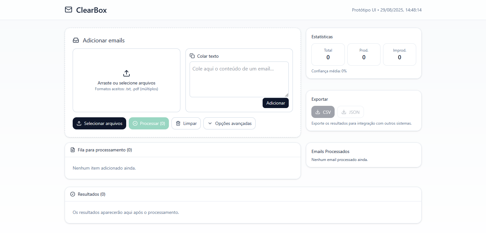

<h1 align="center">
  ClearBox
</h1>

<div align="center" style="display: flex; gap: 16px; justify-content: center;">
  <a href="#">
    
  </a>
  
  <a href="#">
    
  </a>
  
  <a href="#">
    
  </a>
  
  <a href="https://github.com/Kaua-Cavalcante/ClearBox/issues">
    
  </a>
</div>

<p align="center">
  
</p>

## 💻 Projeto

Este projeto é uma solução digital que automatiza a leitura e classificação de emails.   
Ele combina Frontend (React) para interface do usuário e Backend (Python FastAPI) para processamento e classificação.

## 📂 Estrutura do Projeto

```
├── frontend/        # Interface do usuário em React
│   ├── src/components/EmailClassifierUI.jsx
│   ├── src/components/History.jsx
│   └── ...
├── backend/         # API em Python (FastAPI)
│   ├── main.py
│   ├── requirements.txt
│   └── ...
└── README.md
```

## 🚀 Executando o Projeto Localmente

### 1. Clonar o repositório

```bash git clone https://github.com/seu-repositorio/email-classifier.git
cd email-classifier
```

### 2. Configurar o Backend (Python + FastAPI)

#### 1. Acesse a pasta:

```bash
cd backend
```
#### 2. Crie e ative um ambiente virtual:

```bash
python -m venv venv
# Windows
venv\Scripts\activate
# Linux/Mac
source venv/bin/activate
```

#### 3. Instale as dependências:

```bash
pip install -r requirements.txt
```

#### 4. Inicie o servidor:

```bash
uvicorn main:app --reload
```
> O backend estará rodando em: [http://127.0.0.1:8000](http://127.0.0.1:8000)


### 3. Configurar o Frontend (React + Vite)

#### 1. Acesse a pasta:

```bash
cd frontend
```

#### 2. Instale as dependências:

```bash
npm install
```

#### 3. Inicie o servidor de desenvolvimento:

```bash
npm run dev
```
> O frontend estará disponível em: [http://localhost:5173](http://localhost:5173)

## 📊 Funcionalidades
- Classificação de emails como **Produtivo** ou **Improdutivo**.
- Exibição de **porcentagem de confiança** da classificação.
- Sugestão de **resposta automática**.
- Histórico dos últimos emails processados.

## 🔮 Próximos Passos
- Integração com modelos de **NLP mais avançados** (Hugging Face, OpenAI).
- Exportação de relatórios (CSV/PDF).
- Dashboard com estatísticas em tempo real.

## 🛠️ Tecnologias Utilizadas
- **Frontend:** React + TailwindCSS + Vite
- **Backend:** Python + FastAPI + Uvicorn
- **NLP:** Scikit-learn (básico)

### ✨ Desenvolvido para automatizar tarefas repetitivas e **liberar tempo da equipe.**